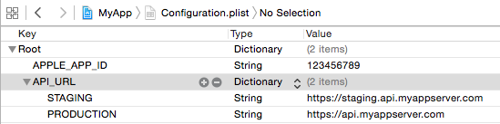
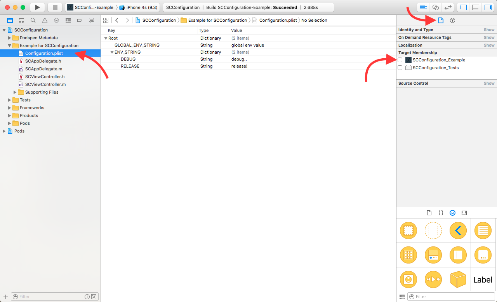
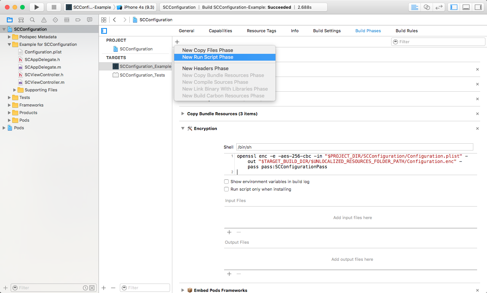

# SCConfiguration

[](https://travis-ci.org/team-supercharge/SCConfiguration)
[](http://cocoadocs.org/docsets/SCConfiguration)
[](http://cocoadocs.org/docsets/SCConfiguration)
[](http://cocoadocs.org/docsets/SCConfiguration)

Made with ♥︎ at Supercharge

## Introduction

With SCConfiguration you can easily manage environment dependent (or global) configuration parameters in a property list file.

Moreover, from version 1.1.0 you can encrypt your configuration file if it contains sensitive information.

## Installation

SCConfiguration is available through [CocoaPods](http://cocoapods.org). To install it, simply add the following line to your Podfile:

```ruby
pod "SCConfiguration"
```

## Usage

### Defining the parameters in the Configuration.plist file

First, you need to create a configuration file called `Configuration.plist` in your project.



You can add global or environment dependent key-value pairs to it, here's an example with `STAGING` and `PRODUCTION` environments.

In source format:

```xml
<dict>
	<key>APPLE_APP_ID</key> <!-- global parameter -->
	<string>123456789</string>
	<key>API_URL</key>  <!-- environment dependent parameter -->
	<dict>
		<key>STAGING</key>
		<string>https://staging.myappserver.com</string>
		<key>PRODUCTION</key>
		<string>https://myappserver.com</string>
	</dict>
</dict>
```

### Setting the environment and reading the parameters

If `ENV` is a preprocessor macro defined by the build configuration you can easily set the configuration class's environment in the `application:didFinishLaunchingWithOptions:` method:

```objective-c
SCConfiguration *configuration = [SCConfiguration new];

// Set the environment defined by the ENV preprocessor macro
[configuration setEnv:ENV];

// Read the API_URL environment dependent value from the configuration
NSString *apiUrl = [configuration configValueForKey:@"API_URL"]
```

You can also use `SCConfiguration` as a singleton:

```objective-c
// Set the environment defined by the ENV preprocessor macro
[[SCConfiguration sharedInstance] setEnv:ENV];

// Read the API_URL environment dependent value from the configuration
NSString *apiUrl = [[SCConfiguration sharedInstance] configValueForKey:@"API_URL"]
```

### Encrypting your Configuration file

If you're using v1.1.0 or above, with a few additional steps you can encrypt your configuration file. This is very useful if the file contains sensitive information such as production API URLs, third party App IDs or client secrets.

The initial problem here is that by default your Configuration.plist file will be added to the .ipa file without encryption. If someone downloads your application from the App Store, unpacks the .ipa file and checks the app's contents, the Configuration file will be there as a plain XML file.

The solution is to remove the plist file from the build, add it as encrypted file with the help of a custom run script and use the SCConfiguration library to read the encrypted file.

**Encryption steps:**

1) select your Configuration.plist file in Xcode and **UNCHECK** the target membership in the Utilities plane / File inspector tab:



2) add a new custom Run Script to your project's Targets with the name `Encryption` and with the following content:

```
openssl enc -e -aes-256-cbc -in "$PROJECT_DIR/SCConfiguration/Configuration.plist" -out "$TARGET_BUILD_DIR/$UNLOCALIZED_RESOURCES_FOLDER_PATH/Configuration.enc" -pass pass:<your password here>
```

**IMPORTANT: You need to replace the Configuration.plist file's path to mach your project's structure and also you should add your own password to this script.**



3) you need to add an extra line to the `application:didFinishLaunchingWithOptions:` method:

```objective-c
[[SCConfiguration sharedInstance] setDecryptionPassword:@"<your password here>"];
```

## Subclassing SCConfiguration

It's a good practice to subclass `SCConfiguration` and declare your configuration parameters explicitly in your application.

```objective-c
// MyAppConfiguration.h

@interface MyAppConfiguration : SCConfiguration

- (NSString *)apiUrl;

@end
```

```objective-c
// MyAppConfiguration.m

@interface MyAppConfiguration : SCConfiguration

- (NSString *)apiUrl
{
    return (NSString *)[self configValueForKey:@"API_URL"];
}

@end
```

## Overriding configuration variables

You can override configuration variable at runtime. This can be useful if you would like to synchronize configuration parameters through a backend service.

You need to add the following line to the `applicationDidEnterBackground:` and `applicationWillTerminate:` methods:

```objective-c
[[SCConfiguration sharedInstance] tearDown];
```

This method saves the configuration modifications between application launches.

You can **overwrite / add key-value pairs**:

* one-by-one:

```objective-c
[[SCConfiguration sharedInstance] setObject:@"a value" forKey:@"key1"];
```

* multiple keys at the same time:

```objective-c
NSDictionary *newConfigValues = @{ @"key1": @"new value", @"new key": @"new value" };
[[SCConfiguration sharedInstance] overwriteConfigWithDictionary:newConfigValues];
```

**NOTE: overwritten key-value pairs will stay between application launches by default! You can change this behaviour by calling the `[[SCConfiguration sharedInstance] setOverwriteStateToPersistent:NO]`.**

Or you can **set key-value pairs to protected / unprotected**:

```objective-c
[[SCConfiguration sharedInstance] setKeysToProtected:@[@"key2", @"key3"]];
[[SCConfiguration sharedInstance] setKeyToProtected:@"key4"];

[[SCConfiguration sharedInstance] removeAllKeyFromProtection];
```

**Protected values cannot be changed / added later.**

## Compatibility

iOS 6+

## Contributing

Contributions are always welcome! (:

1. Fork it ( http://github.com/team-supercharge/SCConfiguration/fork )
2. Create your feature branch (`git checkout -b my-new-feature`)
3. Commit your changes (`git commit -am 'Add some feature'`)
4. Push to the branch (`git push origin my-new-feature`)
5. Create new Pull Request

## License

SCConfiguration is available under the MIT license. See the LICENSE file for more info.
